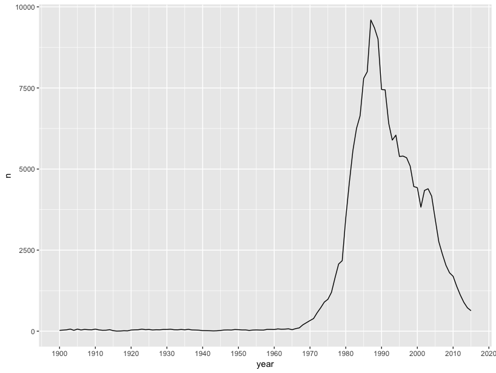

# prenoms

First names given to babies in metropolitan France between 1900 and 2015. 

```
install_github( "ThinkRstat/prenoms" )
library("prenoms")
```

For example, here is the evolution of the first name "romain"

```
library("ggplot2")
romain <- filter( prenoms, name == "Romain" )
ggplot( romain, aes(x = year, y = n) ) + 
  geom_line() + 
  scale_x_continuous( breaks = seq(1900, 2020, by = 10) )
```


