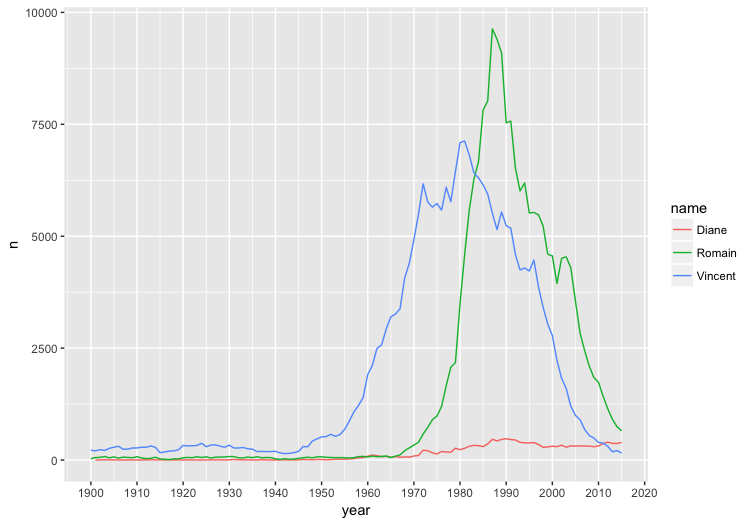

# prenoms

First names given to babies in metropolitan France between 1900 and 2015. 

```
install_github( "ThinkRstat/prenoms" )
library("prenoms")
```

For example, names from current [ThinkR](http://thinkr.fr) staff 
[Diane](https://github.com/DianeBeldame), [Romain](https://github.com/romainfrancois) &
[Vincent](https://github.com/VincentGuyader) through time. 

```
library("ggplot2")
library("dplyr")
thinkrs <- prenoms %>%
  filter( 
    name == "Diane"   & sex == "F" |  
    name == "Romain"  & sex == "M" | 
    name == "Vincent" & sex == "M"   
  ) %>% 
  group_by(name, year, sex) %>%
  summarise( n = sum(n) ) %>%
  arrange( year )

ggplot( thinkrs, aes(x = year, y = n, color = name) ) + 
  geom_line() + 
  scale_x_continuous( breaks = seq(1900, 2020, by = 10) )
```


