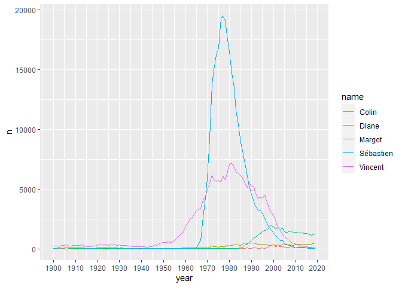

<!-- README.md is generated from README.Rmd. Please edit that file -->

# prenoms

First names given to babies in metropolitan France between 1900 and
2019.

    devtools::install_github( "ThinkR-open/prenoms" )
    library("prenoms")

For example, names from current [ThinkR](https://thinkr.fr) staff
[Colin](https://github.com/colinfay),
[Diane](https://github.com/DianeBeldame),
[Sébastien](https://github.com/statnmap),
[Cervan](https://github.com/Cervangirard) &
[Vincent](https://github.com/VincentGuyader) through time.

``` r
library("ggplot2")
library("dplyr")
library(prenoms)
data(prenoms)
   thinkrs <- prenoms %>%
     filter(
         name == "Diane"   & sex == "F" |
         name == "Sébastien"  & sex == "M" |
         name == "Colin"  & sex == "M" |
         name == "Cervan"  & sex == "M" |
         name == "Margot"  & sex == "F" |
         name == "Vincent" & sex == "M"
     ) %>%
     group_by(name, year, sex) %>%
     summarise( n = sum(n) ) %>%
     arrange( year )

ggplot( thinkrs, aes(x = year, y = n, color = name) ) + 
  geom_line() + 
  scale_x_continuous( breaks = seq(1900, 2020, by = 10) )
```


